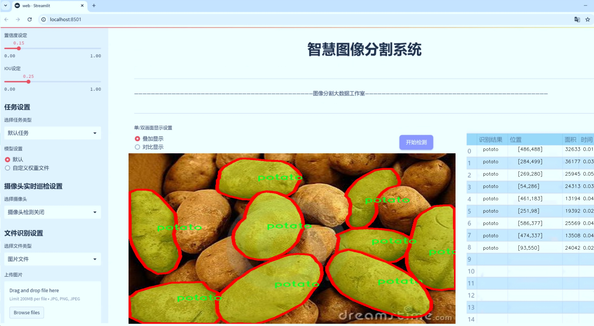
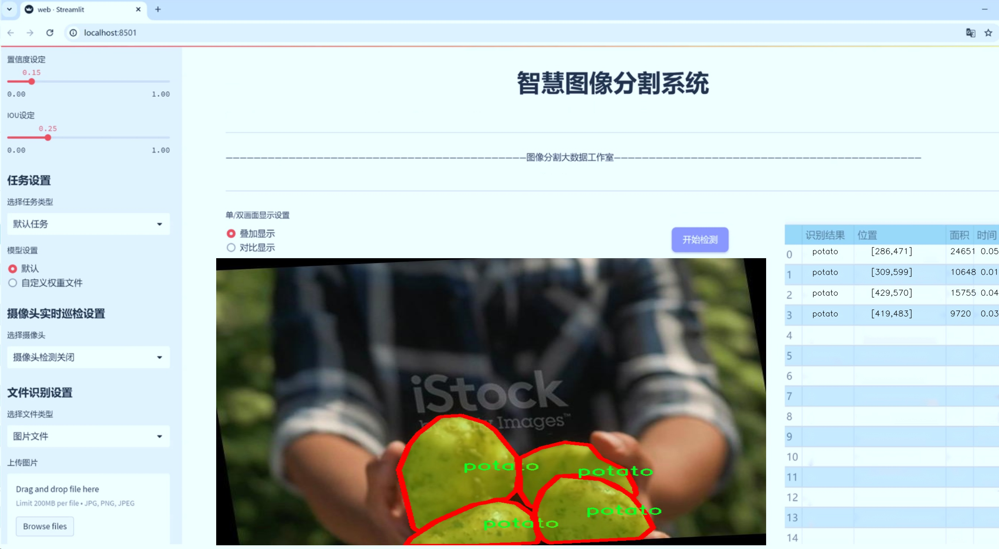
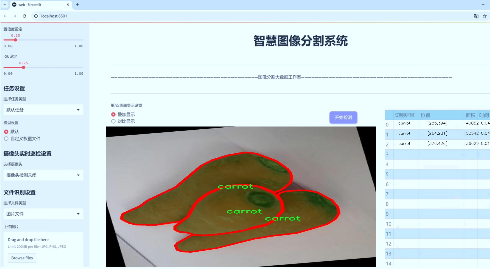
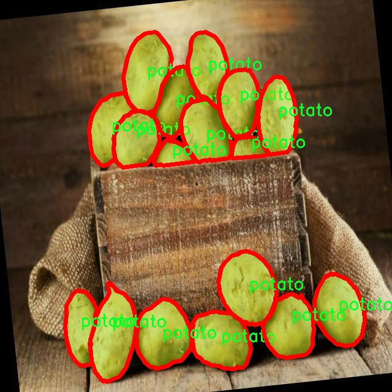
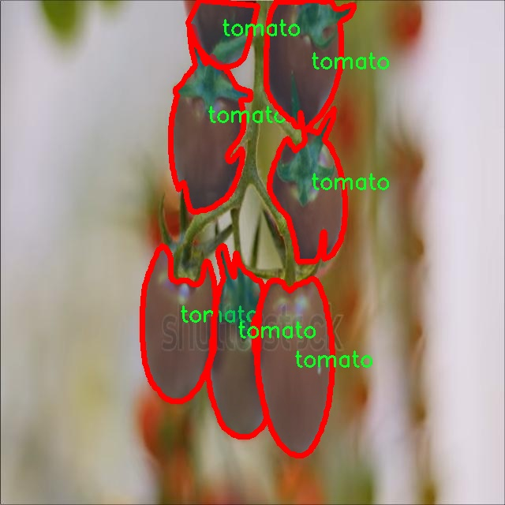
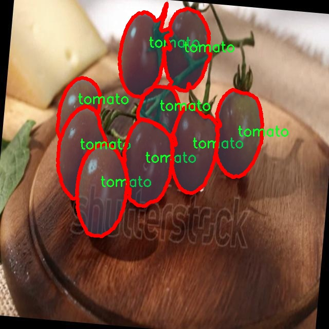
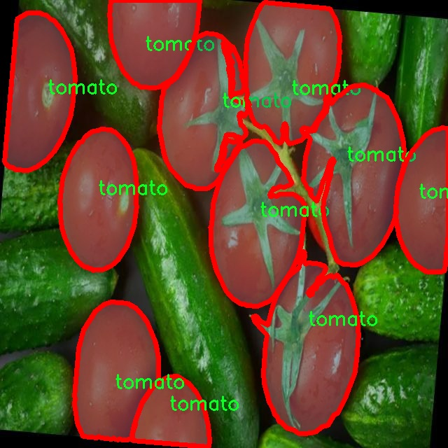
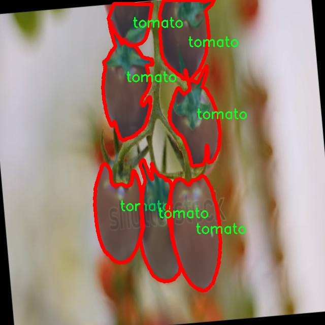

# 蔬菜图像分割系统： yolov8-seg-C2f-Faster

### 1.研究背景与意义

[参考博客](https://gitee.com/YOLOv8_YOLOv11_Segmentation_Studio/projects)

[博客来源](https://kdocs.cn/l/cszuIiCKVNis)

研究背景与意义

随着全球人口的不断增长，食品安全和农业生产效率的提升已成为当今社会亟待解决的重要问题。蔬菜作为人类日常饮食中不可或缺的组成部分，其种植、采摘、运输和销售的各个环节都对蔬菜的质量和安全性提出了更高的要求。在这一背景下，计算机视觉技术的快速发展为农业领域提供了新的解决方案，尤其是在蔬菜的自动化识别与分割方面。近年来，基于深度学习的目标检测与图像分割技术逐渐成为研究热点，其中YOLO（You Only Look Once）系列模型因其高效性和准确性而受到广泛关注。

本研究旨在基于改进的YOLOv8模型，构建一个高效的蔬菜图像分割系统。该系统将针对三种主要蔬菜类别——胡萝卜、土豆和西红柿进行实例分割，利用1100张标注图像的数据集进行训练和测试。通过对YOLOv8模型的改进，期望能够在分割精度和实时性上取得显著提升，从而为蔬菜的智能化管理提供有力支持。

蔬菜图像分割的研究意义主要体现在以下几个方面。首先，精准的蔬菜图像分割技术能够提高农业生产的自动化水平，降低人工成本。在传统的农业生产中，人工识别和分拣蔬菜不仅耗时耗力，而且容易受到人为因素的影响，导致分拣不准确。通过引入基于YOLOv8的图像分割系统，可以实现对蔬菜的快速、准确识别，从而提高生产效率。

其次，蔬菜图像分割技术在食品安全监测中具有重要应用价值。随着消费者对食品安全的关注度不断提升，如何确保蔬菜在种植、运输和销售过程中的安全性成为关键问题。通过对蔬菜图像的实时监测与分析，可以及时发现潜在的质量问题，确保消费者能够获得安全、健康的食品。

此外，基于改进YOLOv8的蔬菜图像分割系统还将为农业科研提供数据支持。通过对不同蔬菜品种的图像数据进行分析，可以为品种改良、病虫害防治等研究提供基础数据，推动农业科技的进步。

最后，本研究的开展不仅具有理论意义，也具备广泛的应用前景。随着智能农业的不断发展，基于深度学习的图像处理技术将在未来的农业生产中发挥越来越重要的作用。通过对YOLOv8模型的改进与应用，能够为相关领域的研究提供新的思路和方法，推动农业与信息技术的深度融合。

综上所述，基于改进YOLOv8的蔬菜图像分割系统的研究不仅能够提升农业生产的效率和安全性，还有助于推动农业科技的进步，具有重要的学术价值和实际应用意义。

### 2.图片演示







注意：本项目提供完整的训练源码数据集和训练教程,由于此博客编辑较早,暂不提供权重文件（best.pt）,需要按照6.训练教程进行训练后实现上图效果。

### 3.视频演示

[3.1 视频演示](https://www.bilibili.com/video/BV1ptzbYREgF/)

### 4.数据集信息

##### 4.1 数据集类别数＆类别名

nc: 3
names: ['carrot', 'potato', 'tomato']


##### 4.2 数据集信息简介

数据集信息展示

在本研究中，我们使用了名为“lab2Vegetable”的数据集，以支持对YOLOv8-seg模型的训练与改进，旨在实现高效的蔬菜图像分割。该数据集专注于三种主要的蔬菜类别：胡萝卜（carrot）、土豆（potato）和西红柿（tomato），共计三类。这一选择不仅反映了蔬菜在日常饮食中的重要性，也为模型的多样性和适应性提供了良好的基础。

“lab2Vegetable”数据集的构建过程充分考虑了图像的多样性和代表性。每一类蔬菜均包含了不同生长阶段、不同品种以及不同环境下的图像。这种多样性确保了模型在实际应用中的鲁棒性，能够有效应对各种复杂的场景。数据集中每个类别的图像均经过精心标注，确保了分割任务的准确性和有效性。标注过程中，使用了高精度的分割工具，确保每个蔬菜的边界清晰可辨，避免了模糊和重叠现象的出现。

在数据集的准备过程中，考虑到了不同的拍摄条件和背景变化。例如，胡萝卜的图像可能在农田、超市或家庭厨房等不同环境中拍摄，而土豆和西红柿的图像同样涵盖了多种背景。这种背景的多样性不仅增加了数据集的复杂性，也为模型的训练提供了更为广泛的应用场景，使得模型能够在真实世界中更好地进行蔬菜分割。

为了确保数据集的质量，数据收集和标注团队对每张图像进行了严格的筛选和审核。图像的分辨率和清晰度都经过精心挑选，以确保模型在训练过程中能够获取足够的特征信息。此外，数据集还包含了一些带有噪声和干扰的图像，以模拟真实环境中的挑战，进一步提升模型的适应能力。

在训练过程中，YOLOv8-seg模型将利用“lab2Vegetable”数据集中的图像进行特征学习和优化。通过对不同类别蔬菜的图像进行分析，模型将逐步掌握各类蔬菜的形状、颜色及其在不同背景下的表现特征。这一过程不仅提高了模型的分割精度，也为后续的应用提供了坚实的基础。

此外，数据集的使用还将为后续的研究提供重要的参考价值。通过对“lab2Vegetable”数据集的深入分析，研究人员可以探索不同蔬菜的特征差异，为未来的图像处理和计算机视觉研究提供新的思路和方向。随着数据集的不断扩展和完善，预计将会有更多的蔬菜类别被纳入研究范围，进一步推动图像分割技术的发展。

总之，“lab2Vegetable”数据集不仅为YOLOv8-seg模型的训练提供了丰富的样本，也为蔬菜图像分割技术的研究奠定了坚实的基础。通过这一数据集的应用，我们期望能够实现更高效、更准确的蔬菜分割系统，为农业生产和食品安全等领域提供有力的技术支持。











### 5.项目依赖环境部署教程（零基础手把手教学）

[5.1 环境部署教程链接（零基础手把手教学）](https://www.bilibili.com/video/BV1jG4Ve4E9t/?vd_source=bc9aec86d164b67a7004b996143742dc)


[5.2 安装Python虚拟环境创建和依赖库安装视频教程链接（零基础手把手教学）](https://www.bilibili.com/video/BV1nA4VeYEze/?vd_source=bc9aec86d164b67a7004b996143742dc)

### 6.手把手YOLOV8-seg训练视频教程（零基础手把手教学）

[6.1 手把手YOLOV8-seg训练视频教程（零基础小白有手就能学会）](https://www.bilibili.com/video/BV1cA4VeYETe/?vd_source=bc9aec86d164b67a7004b996143742dc)


按照上面的训练视频教程链接加载项目提供的数据集，运行train.py即可开始训练



     Epoch   gpu_mem       box       obj       cls    labels  img_size
     1/200     0G   0.01576   0.01955  0.007536        22      1280: 100%|██████████| 849/849 [14:42<00:00,  1.04s/it]
               Class     Images     Labels          P          R     mAP@.5 mAP@.5:.95: 100%|██████████| 213/213 [01:14<00:00,  2.87it/s]
                 all       3395      17314      0.994      0.957      0.0957      0.0843

     Epoch   gpu_mem       box       obj       cls    labels  img_size
     2/200     0G   0.01578   0.01923  0.007006        22      1280: 100%|██████████| 849/849 [14:44<00:00,  1.04s/it]
               Class     Images     Labels          P          R     mAP@.5 mAP@.5:.95: 100%|██████████| 213/213 [01:12<00:00,  2.95it/s]
                 all       3395      17314      0.996      0.956      0.0957      0.0845

     Epoch   gpu_mem       box       obj       cls    labels  img_size
     3/200     0G   0.01561    0.0191  0.006895        27      1280: 100%|██████████| 849/849 [10:56<00:00,  1.29it/s]
               Class     Images     Labels          P          R     mAP@.5 mAP@.5:.95: 100%|███████   | 187/213 [00:52<00:00,  4.04it/s]
                 all       3395      17314      0.996      0.957      0.0957      0.0845


### 7.50+种全套YOLOV8-seg创新点加载调参实验视频教程（一键加载写好的改进模型的配置文件）

[7.1 50+种全套YOLOV8-seg创新点加载调参实验视频教程（一键加载写好的改进模型的配置文件）](https://www.bilibili.com/video/BV1Hw4VePEXv/?vd_source=bc9aec86d164b67a7004b996143742dc)

### YOLOV8-seg算法简介

原始YOLOv8-seg算法原理

YOLOv8-seg算法是YOLO系列的最新发展，结合了目标检测与语义分割的功能，展现了其在计算机视觉领域的强大能力。该算法由Glenn-Jocher提出，作为YOLOv3和YOLOv5的继承者，YOLOv8-seg在多个方面进行了显著的改进，旨在提升目标检测和分割的精度与效率。

首先，YOLOv8-seg在数据预处理方面延续了YOLOv5的策略，采用了一系列增强技术以提高模型的鲁棒性和泛化能力。这些增强手段包括马赛克增强、混合增强、空间扰动和颜色扰动等。这些技术的结合使得模型在面对复杂背景和多样化目标时，能够更好地提取特征，减少过拟合的风险。马赛克增强通过将不同图像拼接在一起，模拟多种场景，从而使模型能够学习到更丰富的特征；而混合增强则通过对图像进行加权叠加，进一步增强了样本的多样性。

在骨干网络结构方面，YOLOv8-seg在YOLOv5的基础上进行了创新，采用了新的C2f模块替代了原有的C3模块。C2f模块通过引入更多的分支，丰富了梯度回传时的支流，使得特征提取更加高效。该模块的设计使得网络能够在不同层次上更好地捕捉特征，从而提升了整体的检测和分割性能。YOLOv8-seg的骨干网络不仅保留了YOLOv5的清晰架构，还在此基础上进行了优化，增强了特征提取的深度和广度。

YOLOv8-seg依然采用了FPN-PAN结构，以实现多尺度信息的充分融合。这一结构的设计使得网络能够在不同尺度上进行特征的提取和融合，从而更好地处理各种尺寸的目标。通过在FPN-PAN结构中引入C2f模块，YOLOv8-seg在特征融合的效率和效果上都有了显著提升。这种多尺度特征融合的能力，使得YOLOv8-seg在处理复杂场景时，能够更好地捕捉到目标的细节信息。

在检测头的设计上，YOLOv8-seg采用了解耦头结构，这一结构的引入使得分类和定位任务能够并行进行，进一步提高了模型的效率。通过将类别特征和位置特征分别提取，YOLOv8-seg能够更精准地进行目标检测和分割。这种解耦设计不仅提升了模型的性能，还为后续的优化和调整提供了更大的灵活性。

标签分配策略是YOLOv8-seg的另一大创新点。不同于YOLOv5依赖于数据集的候选框聚类，YOLOv8-seg采用了动态标签分配策略。这一策略基于TOOD（Target-Object-Oriented Detection）方法，能够在训练过程中根据目标的实际情况动态调整标签分配。这种方法有效地解决了正负样本匹配的问题，使得模型在训练时能够更好地适应不同的目标特征，提升了检测的准确性。

在损失函数的设计上，YOLOv8-seg引入了Varifocal Loss和CIoU Loss等新型损失函数。这些损失函数的设计旨在更好地平衡正负样本的贡献，尤其是在处理高质量正样本时，能够更有效地引导模型学习。这种不对称的损失处理方式，使得模型在训练过程中能够更加关注高质量的样本，从而提升整体的检测精度。

YOLOv8-seg的网络结构由三个主要部分组成：Backbone、Neck和Head。Backbone部分负责特征的提取，采用了一系列卷积和反卷积层，结合残差连接和瓶颈结构，以提高网络的性能和效率。Neck部分则负责多尺度特征的融合，确保不同阶段的特征图能够有效结合，从而提高目标检测的鲁棒性。最后，Head部分负责最终的目标检测和分类任务，通过多个检测头在不同尺寸下进行目标信息的提取，确保模型能够准确识别和分割目标。

总的来说，YOLOv8-seg算法在继承YOLO系列优良传统的基础上，通过一系列创新和优化，展现了其在目标检测与分割领域的强大能力。无论是在数据预处理、网络结构、标签分配还是损失函数的设计上，YOLOv8-seg都体现了对性能和效率的追求。这使得YOLOv8-seg不仅能够在实时检测中达到新的高度，也为各种实际应用提供了强有力的支持，尤其是在复杂环境下的目标识别与分割任务中。随着YOLOv8-seg的不断发展和应用，其在计算机视觉领域的影响力将进一步扩大，为未来的研究和应用提供更多可能性。


### 9.系统功能展示（检测对象为举例，实际内容以本项目数据集为准）

图9.1.系统支持检测结果表格显示

  图9.2.系统支持置信度和IOU阈值手动调节

  图9.3.系统支持自定义加载权重文件best.pt(需要你通过步骤5中训练获得)

  图9.4.系统支持摄像头实时识别

  图9.5.系统支持图片识别

  图9.6.系统支持视频识别

  图9.7.系统支持识别结果文件自动保存

  图9.8.系统支持Excel导出检测结果数据


### 10.50+种全套YOLOV8-seg创新点原理讲解（非科班也可以轻松写刊发刊，V11版本正在科研待更新）

#### 10.1 由于篇幅限制，每个创新点的具体原理讲解就不一一展开，具体见下列网址中的创新点对应子项目的技术原理博客网址【Blog】：


[10.1 50+种全套YOLOV8-seg创新点原理讲解链接](https://gitee.com/qunmasj/good)

#### 10.2 部分改进模块原理讲解(完整的改进原理见上图和技术博客链接)【如果此小节的图加载失败可以通过CSDN或者Github搜索该博客的标题访问原始博客，原始博客图片显示正常】
### YOLOv8模型原理

YOLOv8是YOLO系列最新的模型,具有非常优秀的检测精度和速度。根据网络的深度与特征图的宽度大小, YOLOv8算法分为:YOLOv8-n、YOLOv8一s 、YOLOv8-m 、 YOLOv8-l、和 YOLOv8-x 5个版本。按照网络结构图,YOLOv8可分为: Inpul 、 Backbone , Neck和Head 4部分。


Backbone采用了CSPDarknet 架构，由CBS (标准卷积层)、C2f模块和 SPPF(金字塔池化）组成。通过5次标准卷积层和C2f模块逐步提取图像特征，并在网络末尾添加SPPF模块，将任意大小的输入图像转换成固定大小的特征向量。分别取P3、P4、P5层的特征提取结果，向Head输出80×80、40 × 40、20×20三个尺度的特征层。
C2f模块借鉴了残差网络(ResNet)以及ELAN的思想，其结构分为两个分支，主干部分利用Bottleneckm2%模块逐步加深网络，分支部分保留输入层通道并与主干部分特征进行融合，如图所示。通过标准卷积层提取新的特征层，相比于YOLOv5使用的C3模块，C2f模块可以在卷积层和全连接层之间建立一个平滑的转换，从而实现了参数的共享，提高了模型的效率和泛化能力。
Head采用了PAN-FPN 结构,将 Backbone输入的3个特征层进行多尺度融合，进行自顶向下(FAN)和自底向上 (PAN)的特征传递，对金字塔进行增强，使不同尺寸的特征图都包含强目标语义信息和强目标特征信息，保证了对不同尺寸样本的准确预测。
Detect借鉴了Decoupled-Head 思想，用一个解耦检测头将输入的不同尺寸特征层分成2个分支进行检测。第1个分支在进行3次卷积后使进行回归任务，输出预测框。第2个分支在进行3次卷积后进行分类任务，输出类别的概率。采用Varifocal_Loss2”作为损失函数，其式为:


### Context_Grided_Network(CGNet)简介
参考该博客提出的一种轻量化语义分割模型Context Grided Network(CGNet)，以满足设备的运行需要。

CGNet主要由CG块构建而成，CG块可以学习局部特征和周围环境上下文的联合特征，最后通过引入全局上下文特征进一步改善联合特征的学习。


 
下图给出了在Cityscapes数据集上对现有的一些语义分割模型的测试效果，横轴表示参数量，纵轴表示准确率(mIoU)。可以看出，在参数量较少的情况下，CGNet可以达到一个比较好的准确率。虽与高精度模型相去甚远，但在一些对精度要求不高、对实时性要求比较苛刻的情况下，很有价值。


高精度模型，如DeepLab、DFN、DenseASPP等，动不动就是几十M的参数，很难应用在移动设备上。而上图中红色的模型，相对内存占用较小，但它们的分割精度却不是很高。作者认为主要原因是，这些小网络大多遵循着分类网络的设计思路，并没有考虑语义分割任务更深层次的特点。

空间依赖性和上下文信息对提高分割精度有很大的作用。作者从该角度出发，提出了CG block，并进一步搭建了轻量级语义分割网络CGNet。CG块具有以下特点： 

学习局部特征和上下文特征的联合特征；
通过全局上下文特征改进上述联合特征；
可以贯穿应用在整个网络中，从low level（空间级别）到high level（语义级别）。不像PSPNet、DFN、DenseASPP等，只在编码阶段以后捕捉上下文特征。；
只有3个下采样，相比一般5个下采样的网络，能够更好地保留边缘信息。
CGNet遵循“深而薄”的原则设计，整个网络又51层构成。其中，为了降低计算，大量使用了channel-wise conv.

小型语义分割模型：

需要平衡准确率和系统开销
进化路线：ENet -> ICNet -> ESPNet
这些模型基本都基于分类网络设计，在分割准确率上效果并不是很好
上下文信息模型：

大多数现有模型只考虑解码阶段的上下文信息并且没有利用周围的上下文信息
注意力机制：

CG block使用全局上下文信息计算权重向量，并使用其细化局部特征和周围上下文特征的联合特征

#### Context Guided Block
CG block由4部分组成：


此外，CG block还采用了残差学习。文中提出了局部残差学习（LRL）和全局残差学习（GRL）两种方式。 LRL添加了从输入到联合特征提取器的连接，GRL添加了从输入到全局特征提取器的连接。从直观上来说，GRL比LRL更能促进网络中的信息传递（更像ResNet~~），后面实验部分也进行了测试，的确GRL更能提升分割精度。


CGNet的通用网络结构如下图所示，分为3个stage，第一个stage使用3个卷积层抽取特征，第二和第三个stage堆叠一定数量的CG block，具体个数可以根据情况调整。最后，通过1x1 conv得到分割结果。


下图是用于Cityscapes数据集的CGNet网络细节说明：输入尺寸为3*680*680；stage1连续使用了3个Conv-BN-PReLU组合，首个组合使用了stride=2的卷积，所以得到了1/2分辨率的feature map；stage2和stage3分别使用了多个CG block，且其中使用了不同大小的膨胀卷积核，最终分别得到了1/4和1/8的feature map。

需注意：

stage2&3的输入特征分别由其上一个stage的首个和最后一个block组合给出（参考上图的绿色箭头）；

输入注入机制，图中未体现，实际使用中，作者还将输入图像下采样1/4或1/8，分别给到stage2和stage3的输入中 ，以进一步加强特征传递。

channel-wise conv。为了缩减参数数量，在局部特征提取器和周围上下文特征提取器中使用了channel-wise卷积，可以消除跨通道的计算成本，同时节省内存占用。但是，没有像MobileNet等模型一样，在depth-wise卷积后面接point-wise卷积（1*1 conv），作者解释是，因为CG block需要保持局部特征和周围上下文特征的独立性，而1*1 conv会破坏这种独立性，所以效果欠佳，实验部分也进行了验证。

个人感觉此处应该指的是depth-wise卷积？

官方Git中对该部分的实现如下：


### 11.项目核心源码讲解（再也不用担心看不懂代码逻辑）

#### 11.1 ultralytics\models\fastsam\prompt.py

以下是对代码中最核心部分的提取和详细中文注释：

```python
import os
import numpy as np
import torch
from PIL import Image
import cv2
from ultralytics.utils import TQDM

class FastSAMPrompt:
    """
    Fast Segment Anything Model类，用于图像注释和可视化。

    属性:
        device (str): 计算设备（'cuda'或'cpu'）。
        results: 目标检测或分割结果。
        source: 源图像或图像路径。
        clip: 用于线性分配的CLIP模型。
    """

    def __init__(self, source, results, device='cuda') -> None:
        """初始化FastSAMPrompt，设置源图像、结果和设备，并导入CLIP模型。"""
        self.device = device
        self.results = results
        self.source = source

        # 导入并分配CLIP模型
        try:
            import clip  # 用于线性分配
        except ImportError:
            from ultralytics.utils.checks import check_requirements
            check_requirements('git+https://github.com/openai/CLIP.git')
            import clip
        self.clip = clip

    @staticmethod
    def _format_results(result, filter=0):
        """将检测结果格式化为包含ID、分割、边界框、得分和面积的注释列表。"""
        annotations = []
        n = len(result.masks.data) if result.masks is not None else 0
        for i in range(n):
            mask = result.masks.data[i] == 1.0
            if torch.sum(mask) >= filter:
                annotation = {
                    'id': i,
                    'segmentation': mask.cpu().numpy(),
                    'bbox': result.boxes.data[i],
                    'score': result.boxes.conf[i]}
                annotation['area'] = annotation['segmentation'].sum()
                annotations.append(annotation)
        return annotations

    @staticmethod
    def _get_bbox_from_mask(mask):
        """从分割掩码中获取边界框。"""
        mask = mask.astype(np.uint8)
        contours, _ = cv2.findContours(mask, cv2.RETR_EXTERNAL, cv2.CHAIN_APPROX_SIMPLE)
        x1, y1, w, h = cv2.boundingRect(contours[0])
        x2, y2 = x1 + w, y1 + h
        if len(contours) > 1:
            for b in contours:
                x_t, y_t, w_t, h_t = cv2.boundingRect(b)
                x1 = min(x1, x_t)
                y1 = min(y1, y_t)
                x2 = max(x2, x_t + w_t)
                y2 = max(y2, y_t + h_t)
        return [x1, y1, x2, y2]

    def plot(self, annotations, output):
        """
        在图像上绘制注释、边界框和点，并保存输出。

        参数:
            annotations (list): 要绘制的注释。
            output (str or Path): 保存绘图的输出目录。
        """
        pbar = TQDM(annotations, total=len(annotations))
        for ann in pbar:
            result_name = os.path.basename(ann.path)
            image = ann.orig_img[..., ::-1]  # BGR转RGB
            plt.figure(figsize=(image.shape[1] / 100, image.shape[0] / 100))
            plt.imshow(image)

            if ann.masks is not None:
                masks = ann.masks.data
                for mask in masks:
                    mask = mask.astype(np.uint8)
                    plt.imshow(mask, alpha=0.5)  # 显示掩码

            # 保存图像
            save_path = os.path.join(output, result_name)
            plt.axis('off')
            plt.savefig(save_path, bbox_inches='tight', pad_inches=0, transparent=True)
            plt.close()
            pbar.set_description(f'Saving {result_name} to {save_path}')

    @torch.no_grad()
    def retrieve(self, model, preprocess, elements, search_text: str, device) -> int:
        """处理图像和文本，计算相似度并返回softmax得分。"""
        preprocessed_images = [preprocess(image).to(device) for image in elements]
        tokenized_text = self.clip.tokenize([search_text]).to(device)
        stacked_images = torch.stack(preprocessed_images)
        image_features = model.encode_image(stacked_images)
        text_features = model.encode_text(tokenized_text)
        image_features /= image_features.norm(dim=-1, keepdim=True)
        text_features /= text_features.norm(dim=-1, keepdim=True)
        probs = 100.0 * image_features @ text_features.T
        return probs[:, 0].softmax(dim=0)

    def everything_prompt(self):
        """返回类中处理的结果。"""
        return self.results
```

### 核心部分分析
1. **类的定义和初始化**：`FastSAMPrompt`类负责处理图像分割和注释，初始化时接收源图像、结果和计算设备，并导入CLIP模型。
2. **结果格式化**：`_format_results`方法将检测结果转换为包含必要信息的注释列表，便于后续处理。
3. **边界框提取**：`_get_bbox_from_mask`方法从分割掩码中提取边界框，用于后续的图像裁剪和显示。
4. **绘图功能**：`plot`方法负责在图像上绘制分割结果和边界框，并将结果保存到指定路径。
5. **相似度计算**：`retrieve`方法处理图像和文本，计算它们之间的相似度，返回softmax得分。
6. **结果返回**：`everything_prompt`方法返回处理后的结果，方便后续调用。

这些核心部分构成了FastSAMPrompt类的主要功能，使其能够进行图像分割、注释和可视化。

这个文件是一个用于图像注释和可视化的类，名为 `FastSAMPrompt`，它是基于 Ultralytics YOLO 的实现。该类主要用于处理图像分割和目标检测的结果，并提供了一些方法来可视化这些结果。

在类的初始化方法中，构造函数接受源图像、检测结果和计算设备（如 CUDA 或 CPU）作为参数，并尝试导入 CLIP 模型以进行线性分配。如果 CLIP 模型未安装，则会通过检查依赖项来进行安装。

类中有多个静态方法和实例方法。 `_segment_image` 方法根据给定的边界框对图像进行分割，生成一个新的图像，其中只保留指定区域。 `_format_results` 方法将检测结果格式化为包含 ID、分割掩码、边界框、置信度分数和面积的注释列表。 `_get_bbox_from_mask` 方法则通过对掩码应用形态学变换来获取边界框。

`plot` 方法用于在图像上绘制注释、边界框和点，并将结果保存到指定的输出目录。该方法支持多种可选参数，例如是否使用随机颜色绘制掩码、是否应用形态学变换以提高掩码质量等。

`fast_show_mask` 方法则是在给定的 matplotlib 轴上快速显示掩码注释的工具。它支持绘制边界框和点，并可以选择是否使用视网膜掩码。

`retrieve` 方法用于处理图像和文本，通过模型计算相似度并返回 softmax 分数。`_crop_image` 方法根据提供的注释格式裁剪图像，并返回裁剪后的图像及相关数据。

`box_prompt` 和 `point_prompt` 方法分别用于根据用户输入的边界框和点调整检测到的掩码，并返回修改后的结果。`text_prompt` 方法则处理文本提示，将其应用于现有结果并返回更新后的结果。

最后，`everything_prompt` 方法返回类中处理过的结果。这些方法结合起来，使得该类能够有效地处理图像分割和目标检测的任务，并提供灵活的可视化和交互功能。

#### 11.2 ultralytics\models\sam\modules\encoders.py

以下是代码中最核心的部分，并附上详细的中文注释：

```python
import torch
import torch.nn as nn
import torch.nn.functional as F

class ImageEncoderViT(nn.Module):
    """
    使用视觉变换器（ViT）架构的图像编码器，将图像编码为紧凑的潜在空间。
    编码器将图像分割为多个块，并通过一系列变换块处理这些块。
    最终的编码表示通过一个“neck”模块生成。
    """

    def __init__(self, img_size: int = 1024, patch_size: int = 16, in_chans: int = 3, embed_dim: int = 768, depth: int = 12, num_heads: int = 12, out_chans: int = 256):
        """
        初始化图像编码器的参数。

        Args:
            img_size (int): 输入图像的大小。
            patch_size (int): 每个块的大小。
            in_chans (int): 输入图像的通道数。
            embed_dim (int): 块嵌入的维度。
            depth (int): ViT的深度。
            num_heads (int): 每个ViT块中的注意力头数。
            out_chans (int): 输出通道数。
        """
        super().__init__()
        self.img_size = img_size

        # 创建块嵌入模块，将图像分割为块并进行嵌入
        self.patch_embed = PatchEmbed(
            kernel_size=(patch_size, patch_size),
            stride=(patch_size, patch_size),
            in_chans=in_chans,
            embed_dim=embed_dim,
        )

        # 创建变换块列表
        self.blocks = nn.ModuleList()
        for _ in range(depth):
            block = Block(dim=embed_dim, num_heads=num_heads)
            self.blocks.append(block)

        # 创建“neck”模块，进一步处理输出
        self.neck = nn.Sequential(
            nn.Conv2d(embed_dim, out_chans, kernel_size=1, bias=False),
            nn.LayerNorm(out_chans),
            nn.Conv2d(out_chans, out_chans, kernel_size=3, padding=1, bias=False),
            nn.LayerNorm(out_chans),
        )

    def forward(self, x: torch.Tensor) -> torch.Tensor:
        """处理输入，通过块嵌入、变换块和“neck”模块生成最终输出。"""
        x = self.patch_embed(x)  # 将输入图像分割为块并嵌入
        for blk in self.blocks:  # 通过每个变换块处理
            x = blk(x)
        return self.neck(x.permute(0, 3, 1, 2))  # 调整维度并通过“neck”模块输出


class Block(nn.Module):
    """变换块，包含注意力机制和前馈网络。"""

    def __init__(self, dim: int, num_heads: int):
        """
        初始化变换块的参数。

        Args:
            dim (int): 输入通道数。
            num_heads (int): 注意力头数。
        """
        super().__init__()
        self.norm1 = nn.LayerNorm(dim)  # 归一化层
        self.attn = Attention(dim, num_heads)  # 注意力机制
        self.norm2 = nn.LayerNorm(dim)  # 归一化层
        self.mlp = MLPBlock(embedding_dim=dim)  # 前馈网络

    def forward(self, x: torch.Tensor) -> torch.Tensor:
        """执行变换块的前向传播。"""
        shortcut = x  # 保存输入以便于残差连接
        x = self.norm1(x)  # 归一化
        x = self.attn(x)  # 通过注意力机制
        x = shortcut + x  # 残差连接
        return x + self.mlp(self.norm2(x))  # 通过前馈网络并返回


class Attention(nn.Module):
    """多头注意力机制。"""

    def __init__(self, dim: int, num_heads: int):
        """
        初始化注意力模块的参数。

        Args:
            dim (int): 输入通道数。
            num_heads (int): 注意力头数。
        """
        super().__init__()
        self.num_heads = num_heads
        self.qkv = nn.Linear(dim, dim * 3)  # 查询、键、值的线性变换
        self.proj = nn.Linear(dim, dim)  # 输出线性变换

    def forward(self, x: torch.Tensor) -> torch.Tensor:
        """执行注意力机制的前向传播。"""
        B, H, W, _ = x.shape  # 获取输入的批次大小和空间维度
        qkv = self.qkv(x).reshape(B, H * W, 3, self.num_heads, -1).permute(2, 0, 3, 1, 4)  # 计算q、k、v
        q, k, v = qkv.reshape(3, B * self.num_heads, H * W, -1).unbind(0)  # 分离q、k、v

        attn = (q @ k.transpose(-2, -1))  # 计算注意力权重
        attn = attn.softmax(dim=-1)  # 归一化注意力权重
        x = (attn @ v).view(B, self.num_heads, H, W, -1).permute(0, 2, 3, 1, 4).reshape(B, H, W, -1)  # 计算输出
        return self.proj(x)  # 通过线性变换输出

class PatchEmbed(nn.Module):
    """图像到块的嵌入。"""

    def __init__(self, kernel_size: Tuple[int, int] = (16, 16), in_chans: int = 3, embed_dim: int = 768):
        """
        初始化块嵌入模块。

        Args:
            kernel_size (Tuple): 卷积核大小。
            in_chans (int): 输入图像的通道数。
            embed_dim (int): 块嵌入的维度。
        """
        super().__init__()
        self.proj = nn.Conv2d(in_chans, embed_dim, kernel_size=kernel_size)  # 卷积层进行块嵌入

    def forward(self, x: torch.Tensor) -> torch.Tensor:
        """计算块嵌入。"""
        return self.proj(x).permute(0, 2, 3, 1)  # B C H W -> B H W C
```

### 代码核心部分说明：
1. **ImageEncoderViT**: 这是主要的图像编码器类，使用视觉变换器架构。它将输入图像分割为多个块，并通过变换块进行处理，最后通过“neck”模块生成最终的编码表示。

2. **Block**: 变换块，包含注意力机制和前馈网络。它使用残差连接和归一化层来增强训练效果。

3. **Attention**: 多头注意力机制，负责计算输入的注意力权重，并生成输出。

4. **PatchEmbed**: 将输入图像分割为块并进行嵌入的模块。通过卷积操作实现。

这些核心部分共同构成了图像编码器的基础，能够将输入图像转换为紧凑的潜在表示。

这个程序文件定义了一个图像编码器和一个提示编码器，主要用于图像处理和计算机视觉任务，特别是在使用视觉变换器（ViT）架构的上下文中。程序中包含多个类，每个类负责不同的功能。

首先，`ImageEncoderViT`类是一个图像编码器，使用ViT架构将输入图像编码为紧凑的潜在空间。它的构造函数接收多个参数，包括输入图像的大小、补丁大小、输入通道数、嵌入维度、深度、注意力头数等。这个类的主要工作流程是将输入图像分割成多个补丁，并通过一系列的变换块（transformer blocks）处理这些补丁。处理后的补丁会通过一个“颈部”模块进一步生成最终的编码表示。

在`ImageEncoderViT`的`forward`方法中，输入图像首先通过补丁嵌入模块进行处理，如果使用了绝对位置嵌入，则将其添加到补丁嵌入中。接着，经过所有的变换块，最后通过颈部模块输出编码结果。

接下来是`PromptEncoder`类，它用于编码不同类型的提示，包括点、框和掩码，以便输入到SAM的掩码解码器。该类生成稀疏和密集的嵌入，支持多种输入格式。构造函数中定义了嵌入维度、输入图像大小、图像嵌入大小等参数，并初始化了用于点和掩码的嵌入模块。

`PromptEncoder`的`forward`方法处理不同类型的提示，返回稀疏和密集的嵌入。它首先获取批次大小，然后根据输入的点、框和掩码分别生成相应的嵌入，最后将这些嵌入组合成输出。

`PositionEmbeddingRandom`类用于生成随机空间频率的位置信息。它的构造函数初始化了一个位置嵌入矩阵，并提供了一个方法来生成特定大小的网格的位置信息。

`Block`类实现了变换器块，支持窗口注意力和残差传播。它的构造函数接收多个参数，设置了归一化层、注意力模块和多层感知机（MLP）模块。`forward`方法执行前向传播，包括对输入的归一化、注意力计算和MLP处理。

`Attention`类实现了多头注意力机制，支持相对位置嵌入。它的构造函数初始化了查询、键、值的线性变换，并在需要时初始化相对位置嵌入。`forward`方法计算注意力分数并应用于值。

此外，程序中还定义了一些辅助函数，如`window_partition`和`window_unpartition`，用于将输入张量划分为窗口和恢复原始形状，以及`get_rel_pos`和`add_decomposed_rel_pos`，用于处理相对位置嵌入。

最后，`PatchEmbed`类负责将图像转换为补丁嵌入，使用卷积操作来实现。它的`forward`方法将输入图像进行卷积处理，并调整输出张量的维度。

整体而言，这个程序文件实现了一个基于ViT的图像编码器和提示编码器，能够有效地处理图像和提示信息，为后续的计算机视觉任务提供支持。

#### 11.3 ultralytics\models\fastsam\utils.py

以下是代码中最核心的部分，并附上详细的中文注释：

```python
import torch

def adjust_bboxes_to_image_border(boxes, image_shape, threshold=20):
    """
    调整边界框，使其在距离图像边界一定阈值内时，贴合图像边界。

    参数:
        boxes (torch.Tensor): 边界框坐标，形状为(n, 4)
        image_shape (tuple): 图像的高度和宽度，形状为(height, width)
        threshold (int): 像素阈值

    返回:
        adjusted_boxes (torch.Tensor): 调整后的边界框
    """

    # 获取图像的高度和宽度
    h, w = image_shape

    # 调整边界框坐标
    boxes[boxes[:, 0] < threshold, 0] = 0  # 将左上角x坐标小于阈值的设置为0
    boxes[boxes[:, 1] < threshold, 1] = 0  # 将左上角y坐标小于阈值的设置为0
    boxes[boxes[:, 2] > w - threshold, 2] = w  # 将右下角x坐标大于图像宽度减去阈值的设置为图像宽度
    boxes[boxes[:, 3] > h - threshold, 3] = h  # 将右下角y坐标大于图像高度减去阈值的设置为图像高度
    return boxes


def bbox_iou(box1, boxes, iou_thres=0.9, image_shape=(640, 640), raw_output=False):
    """
    计算一个边界框与一组其他边界框的交并比（IoU）。

    参数:
        box1 (torch.Tensor): 单个边界框的坐标，形状为(4, )
        boxes (torch.Tensor): 其他边界框的坐标，形状为(n, 4)
        iou_thres (float): IoU阈值
        image_shape (tuple): 图像的高度和宽度，形状为(height, width)
        raw_output (bool): 如果为True，返回原始IoU值而不是索引

    返回:
        high_iou_indices (torch.Tensor): IoU大于阈值的边界框索引
    """
    # 调整边界框，使其贴合图像边界
    boxes = adjust_bboxes_to_image_border(boxes, image_shape)

    # 计算交集的坐标
    x1 = torch.max(box1[0], boxes[:, 0])  # 交集左上角x坐标
    y1 = torch.max(box1[1], boxes[:, 1])  # 交集左上角y坐标
    x2 = torch.min(box1[2], boxes[:, 2])  # 交集右下角x坐标
    y2 = torch.min(box1[3], boxes[:, 3])  # 交集右下角y坐标

    # 计算交集的面积
    intersection = (x2 - x1).clamp(0) * (y2 - y1).clamp(0)

    # 计算两个边界框的面积
    box1_area = (box1[2] - box1[0]) * (box1[3] - box1[1])  # box1的面积
    box2_area = (boxes[:, 2] - boxes[:, 0]) * (boxes[:, 3] - boxes[:, 1])  # boxes的面积

    # 计算并集的面积
    union = box1_area + box2_area - intersection

    # 计算IoU
    iou = intersection / union  # 结果形状为(n, )
    if raw_output:
        return 0 if iou.numel() == 0 else iou  # 如果需要原始IoU值，直接返回

    # 返回IoU大于阈值的边界框索引
    return torch.nonzero(iou > iou_thres).flatten()
```

### 代码说明：
1. **adjust_bboxes_to_image_border** 函数用于调整边界框的位置，使其在距离图像边界一定阈值内时，自动贴合到图像的边界。
2. **bbox_iou** 函数计算一个边界框与一组其他边界框的交并比（IoU），并返回与给定阈值比较后，IoU值大于阈值的边界框索引。

这个程序文件主要包含两个函数，分别用于调整边界框的位置和计算边界框之间的交并比（IoU）。

第一个函数 `adjust_bboxes_to_image_border` 的作用是将边界框调整到图像的边界上，如果它们距离边界的距离小于指定的阈值。该函数接收三个参数：`boxes` 是一个形状为 (n, 4) 的张量，表示 n 个边界框的坐标；`image_shape` 是一个元组，包含图像的高度和宽度；`threshold` 是一个整数，表示距离边界的阈值。函数内部首先获取图像的高度和宽度，然后通过条件判断调整边界框的坐标，确保它们不会超出图像的边界。最后，返回调整后的边界框。

第二个函数 `bbox_iou` 用于计算一个边界框与一组其他边界框之间的交并比。该函数接收多个参数：`box1` 是一个形状为 (4,) 的张量，表示待计算的边界框；`boxes` 是一个形状为 (n, 4) 的张量，表示其他 n 个边界框；`iou_thres` 是一个浮点数，表示 IoU 的阈值；`image_shape` 是图像的高度和宽度；`raw_output` 是一个布尔值，指示是否返回原始的 IoU 值。函数首先调用 `adjust_bboxes_to_image_border` 来调整 `boxes` 的位置，然后计算交集的坐标，并进一步计算交集的面积。接着，计算两个边界框的面积，并通过交集和并集的面积计算 IoU。最后，如果 `raw_output` 为真，则返回 IoU 值；否则，返回与阈值比较后，IoU 大于阈值的边界框的索引。

总体来说，这个文件提供了处理边界框的基本工具，适用于目标检测等计算机视觉任务。

#### 11.4 ultralytics\data\converter.py

以下是代码中最核心的部分，并附上详细的中文注释：

```python
def coco91_to_coco80_class():
    """
    将91个COCO类ID转换为80个COCO类ID。

    返回:
        (list): 一个包含91个类ID的列表，其中索引表示80个类ID，值为对应的91个类ID。
    """
    return [
        0, 1, 2, 3, 4, 5, 6, 7, 8, 9, 10, None, 11, 12, 13, 14, 15, 16, 17, 18, 19, 20, 21, 22, 23, None, 24, 25, None,
        None, 26, 27, 28, 29, 30, 31, 32, 33, 34, 35, 36, 37, 38, 39, None, 40, 41, 42, 43, 44, 45, 46, 47, 48, 49, 50,
        51, 52, 53, 54, 55, 56, 57, 58, 59, None, 60, None, None, 61, None, 62, 63, 64, 65, 66, 67, 68, 69, 70, 71, 72,
        None, 73, 74, 75, 76, 77, 78, 79, None]

def convert_coco(labels_dir='../coco/annotations/',
                 save_dir='coco_converted/',
                 use_segments=False,
                 use_keypoints=False,
                 cls91to80=True):
    """
    将COCO数据集的注释转换为适合训练YOLO模型的YOLO注释格式。

    参数:
        labels_dir (str, optional): 包含COCO数据集注释文件的目录路径。
        save_dir (str, optional): 保存结果的目录路径。
        use_segments (bool, optional): 是否在输出中包含分割掩码。
        use_keypoints (bool, optional): 是否在输出中包含关键点注释。
        cls91to80 (bool, optional): 是否将91个COCO类ID映射到对应的80个COCO类ID。

    输出:
        在指定的输出目录中生成输出文件。
    """

    # 创建数据集目录
    save_dir = increment_path(save_dir)  # 如果保存目录已存在，则增加后缀
    for p in save_dir / 'labels', save_dir / 'images':
        p.mkdir(parents=True, exist_ok=True)  # 创建目录

    # 转换类
    coco80 = coco91_to_coco80_class()

    # 导入json文件
    for json_file in sorted(Path(labels_dir).resolve().glob('*.json')):
        fn = Path(save_dir) / 'labels' / json_file.stem.replace('instances_', '')  # 文件夹名称
        fn.mkdir(parents=True, exist_ok=True)
        with open(json_file) as f:
            data = json.load(f)

        # 创建图像字典
        images = {f'{x["id"]:d}': x for x in data['images']}
        # 创建图像-注释字典
        imgToAnns = defaultdict(list)
        for ann in data['annotations']:
            imgToAnns[ann['image_id']].append(ann)

        # 写入标签文件
        for img_id, anns in TQDM(imgToAnns.items(), desc=f'Annotations {json_file}'):
            img = images[f'{img_id:d}']
            h, w, f = img['height'], img['width'], img['file_name']

            bboxes = []  # 存储边界框
            segments = []  # 存储分割
            keypoints = []  # 存储关键点
            for ann in anns:
                if ann['iscrowd']:
                    continue  # 跳过拥挤的注释
                # COCO框格式为 [左上角x, 左上角y, 宽度, 高度]
                box = np.array(ann['bbox'], dtype=np.float64)
                box[:2] += box[2:] / 2  # 将左上角坐标转换为中心坐标
                box[[0, 2]] /= w  # 归一化x坐标
                box[[1, 3]] /= h  # 归一化y坐标
                if box[2] <= 0 or box[3] <= 0:  # 如果宽度或高度小于等于0
                    continue

                cls = coco80[ann['category_id'] - 1] if cls91to80 else ann['category_id'] - 1  # 类别
                box = [cls] + box.tolist()  # 将类别和边界框合并
                if box not in bboxes:
                    bboxes.append(box)  # 添加边界框
                if use_segments and ann.get('segmentation') is not None:
                    # 处理分割
                    # 省略的代码...
                if use_keypoints and ann.get('keypoints') is not None:
                    # 处理关键点
                    # 省略的代码...

            # 写入文件
            with open((fn / f).with_suffix('.txt'), 'a') as file:
                for i in range(len(bboxes)):
                    if use_keypoints:
                        line = *(keypoints[i]),  # 类别, 边界框, 关键点
                    else:
                        line = *(segments[i] if use_segments and len(segments[i]) > 0 else bboxes[i]),  # 类别, 边界框或分割
                    file.write(('%g ' * len(line)).rstrip() % line + '\n')

    LOGGER.info(f'COCO数据成功转换。\n结果保存到 {save_dir.resolve()}')
```

### 代码核心部分解释：
1. **coco91_to_coco80_class**: 该函数用于将COCO数据集中91个类的ID转换为80个类的ID，返回一个列表，列表的索引对应80个类的ID，值为对应的91个类ID。

2. **convert_coco**: 该函数是核心的转换功能，将COCO数据集的注释文件转换为YOLO格式。它会创建必要的目录，读取COCO的JSON注释文件，处理每个图像的注释，生成YOLO格式的标签文件。支持分割和关键点的输出。

3. **边界框处理**: 在处理每个注释时，函数会将COCO的边界框格式转换为YOLO格式，并进行归一化处理，确保坐标在[0, 1]范围内。

4. **写入文件**: 最后，函数将处理后的边界框、分割和关键点信息写入到相应的文本文件中，以供YOLO模型训练使用。

这个程序文件 `converter.py` 是用于将 COCO 数据集的标注格式转换为 YOLO 模型所需的标注格式。它主要包含了几个功能模块，能够处理 COCO 数据集和 DOTA 数据集的标注转换。

首先，文件中定义了两个函数 `coco91_to_coco80_class` 和 `coco80_to_coco91_class`，它们分别用于将 COCO 数据集中的 91 个类别 ID 转换为 80 个类别 ID，以及反向转换。这是因为在不同的应用场景中，可能需要使用不同的类别 ID 体系。

接下来，`convert_coco` 函数是文件的核心功能，它负责将 COCO 数据集的标注文件转换为 YOLO 格式。该函数接受多个参数，包括标注文件的目录、保存结果的目录、是否使用分割掩码和关键点等。函数首先创建保存结果的目录，然后读取指定目录下的 JSON 格式的标注文件，解析其中的图像和标注信息。对于每个图像，它会提取出边界框、分割和关键点信息，并将其转换为 YOLO 格式。转换过程中，还会根据需要将类别 ID 进行映射，并将结果写入相应的文本文件中。

此外，文件中还定义了 `convert_dota_to_yolo_obb` 函数，用于将 DOTA 数据集的标注转换为 YOLO 的有向边界框格式。该函数会遍历 DOTA 数据集中的训练和验证图像，读取原始标注文件，并将其转换为 YOLO 格式的标注文件。它使用了一个类名到索引的映射字典，以便将类别名称转换为对应的索引。

文件中还包含了一些辅助函数，例如 `min_index` 用于找到两个数组中距离最短的点对，`merge_multi_segment` 用于合并多个分割段落，以便生成更为连贯的分割信息。

总的来说，这个程序文件提供了一整套用于数据集标注格式转换的工具，能够帮助用户将 COCO 和 DOTA 数据集的标注转换为 YOLO 所需的格式，以便进行模型训练和评估。

#### 11.5 ultralytics\solutions\ai_gym.py

以下是代码中最核心的部分，并附上详细的中文注释：

```python
import cv2
from ultralytics.utils.plotting import Annotator

class AIGym:
    """用于管理基于姿势的实时视频流中的健身步骤的类。"""

    def __init__(self):
        """初始化AIGym，设置视觉和图像参数的默认值。"""
        self.im0 = None  # 当前帧图像
        self.tf = None   # 线条厚度
        self.keypoints = None  # 姿势关键点
        self.poseup_angle = None  # 上升姿势的角度阈值
        self.posedown_angle = None  # 下降姿势的角度阈值
        self.threshold = 0.001  # 阈值，用于判断姿势变化

        # 存储阶段、计数和角度信息
        self.angle = None  # 当前角度
        self.count = None  # 当前计数
        self.stage = None  # 当前阶段
        self.pose_type = 'pushup'  # 姿势类型（如俯卧撑）
        self.kpts_to_check = None  # 需要检查的关键点

        self.view_img = False  # 是否显示图像
        self.annotator = None  # 注释器对象

    def set_args(self, kpts_to_check, line_thickness=2, view_img=False, pose_up_angle=145.0, pose_down_angle=90.0, pose_type='pullup'):
        """
        配置AIGym的参数，包括线条厚度、图像保存和显示参数。
        Args:
            kpts_to_check (list): 用于计数的3个关键点
            line_thickness (int): 边界框的线条厚度
            view_img (bool): 是否显示图像
            pose_up_angle (float): 设置上升姿势的角度
            pose_down_angle (float): 设置下降姿势的角度
            pose_type: "pushup", "pullup" 或 "abworkout"
        """
        self.kpts_to_check = kpts_to_check  # 设置需要检查的关键点
        self.tf = line_thickness  # 设置线条厚度
        self.view_img = view_img  # 设置是否显示图像
        self.poseup_angle = pose_up_angle  # 设置上升姿势的角度
        self.posedown_angle = pose_down_angle  # 设置下降姿势的角度
        self.pose_type = pose_type  # 设置姿势类型

    def start_counting(self, im0, results, frame_count):
        """
        用于计数健身步骤的函数。
        Args:
            im0 (ndarray): 来自视频流的当前帧
            results: 姿势估计数据
            frame_count: 当前帧计数
        """
        self.im0 = im0  # 保存当前帧图像
        if frame_count == 1:
            self.count = [0] * len(results[0])  # 初始化计数
            self.angle = [0] * len(results[0])  # 初始化角度
            self.stage = ['-' for _ in results[0]]  # 初始化阶段

        self.keypoints = results[0].keypoints.data  # 获取关键点数据
        self.annotator = Annotator(im0, line_width=2)  # 创建注释器对象

        for ind, k in enumerate(reversed(self.keypoints)):
            # 根据不同的姿势类型进行角度和计数的计算
            self.angle[ind] = self.annotator.estimate_pose_angle(k[int(self.kpts_to_check[0])].cpu(),
                                                                 k[int(self.kpts_to_check[1])].cpu(),
                                                                 k[int(self.kpts_to_check[2])].cpu())
            self.im0 = self.annotator.draw_specific_points(k, self.kpts_to_check, shape=(640, 640), radius=10)

            # 处理不同的姿势类型
            if self.pose_type == 'abworkout':
                if self.angle[ind] > self.poseup_angle:
                    self.stage[ind] = 'down'
                if self.angle[ind] < self.posedown_angle and self.stage[ind] == 'down':
                    self.stage[ind] = 'up'
                    self.count[ind] += 1

            elif self.pose_type == 'pushup':
                if self.angle[ind] > self.poseup_angle:
                    self.stage[ind] = 'up'
                if self.angle[ind] < self.posedown_angle and self.stage[ind] == 'up':
                    self.stage[ind] = 'down'
                    self.count[ind] += 1

            elif self.pose_type == 'pullup':
                if self.angle[ind] > self.poseup_angle:
                    self.stage[ind] = 'down'
                if self.angle[ind] < self.posedown_angle and self.stage[ind] == 'down':
                    self.stage[ind] = 'up'
                    self.count[ind] += 1

            # 绘制角度、计数和阶段信息
            self.annotator.plot_angle_and_count_and_stage(angle_text=self.angle[ind],
                                                          count_text=self.count[ind],
                                                          stage_text=self.stage[ind],
                                                          center_kpt=k[int(self.kpts_to_check[1])],
                                                          line_thickness=self.tf)

            self.annotator.kpts(k, shape=(640, 640), radius=1, kpt_line=True)  # 绘制关键点

        # 如果需要显示图像，则进行显示
        if self.view_img:
            cv2.imshow('Ultralytics YOLOv8 AI GYM', self.im0)
            if cv2.waitKey(1) & 0xFF == ord('q'):
                return  # 按下'q'键退出

if __name__ == '__main__':
    AIGym()  # 创建AIGym实例
```

### 代码核心部分说明：
1. **类初始化**：在`__init__`方法中，定义了类的基本属性，包括图像、关键点、角度、计数和阶段等。
2. **参数设置**：`set_args`方法用于配置需要的参数，如关键点、线条厚度、姿势类型等。
3. **计数逻辑**：`start_counting`方法实现了根据姿势估计数据计算健身动作的计数和阶段的逻辑。根据不同的姿势类型（如俯卧撑、引体向上等），判断当前的角度和阶段，并更新计数。
4. **图像显示**：如果设置了显示图像的参数，则使用OpenCV显示当前帧图像，并允许通过按键退出。

这个程序文件定义了一个名为 `AIGym` 的类，主要用于在实时视频流中管理基于人体姿势的健身动作计数。该类的功能包括初始化参数、设置动作计数的相关参数、以及在视频流中进行姿势估计和计数。

在类的初始化方法 `__init__` 中，定义了一些用于图像处理和姿势估计的默认值。这些值包括图像数据、线条厚度、关键点信息、姿势角度、计数和状态等。特别地，`pose_type` 属性用于指定当前的健身动作类型（如俯卧撑、引体向上或腹部锻炼）。

`set_args` 方法用于配置一些参数，包括需要检查的关键点、线条厚度、是否显示图像、以及姿势的上下角度等。这些参数将影响后续的动作计数和姿势估计。

`start_counting` 方法是核心功能，负责在每一帧中进行动作计数。它接收当前帧图像、姿势估计结果和帧计数作为输入。在方法内部，首先将当前帧图像和结果存储起来。如果是第一帧，则初始化计数、角度和状态信息。接着，程序遍历每个关键点，计算相应的姿势角度，并根据当前的姿势类型（如俯卧撑、引体向上或腹部锻炼）进行不同的处理。

对于每种姿势类型，程序会根据计算出的角度更新当前的状态（如“上”或“下”），并在满足条件时增加计数。每次计算后，程序还会使用 `Annotator` 类绘制关键点、角度、计数和状态信息到图像上。

最后，如果设置了 `view_img` 为 `True`，程序会使用 OpenCV 显示当前处理的图像，并在按下 'q' 键时退出显示。

整体来看，这个程序实现了一个实时健身动作计数系统，能够通过视频流分析用户的姿势并进行计数，适用于健身监测和训练反馈等场景。

### 12.系统整体结构（节选）

### 整体功能和构架概括

该程序包主要围绕计算机视觉和深度学习任务构建，特别是在目标检测、图像分割和姿势估计等领域。整体架构包括数据处理、模型编码、标注转换和实时应用等多个模块。各个文件的功能如下：

1. **模型和编码器**：实现了图像和提示的编码，使用视觉变换器（ViT）架构进行图像特征提取。
2. **数据处理**：提供了用于处理和转换数据集标注格式的工具，支持将 COCO 和 DOTA 数据集转换为 YOLO 格式。
3. **实用工具**：包含了处理边界框的基本功能，如调整边界框位置和计算交并比（IoU）。
4. **实时应用**：实现了一个实时健身动作计数系统，通过视频流分析用户的姿势并进行计数。

### 文件功能整理表

| 文件路径                                      | 功能描述                                                                                   |
|-------------------------------------------|------------------------------------------------------------------------------------------|
| `ultralytics/models/fastsam/prompt.py`   | 实现图像分割和目标检测的可视化工具，处理注释、边界框和掩码，支持用户交互和结果展示。                     |
| `ultralytics/models/sam/modules/encoders.py` | 定义图像编码器和提示编码器，使用视觉变换器（ViT）架构进行图像特征提取和提示信息编码。                   |
| `ultralytics/models/fastsam/utils.py`     | 提供处理边界框的工具，包括调整边界框位置和计算交并比（IoU）。                                     |
| `ultralytics/data/converter.py`           | 实现 COCO 和 DOTA 数据集标注格式转换为 YOLO 格式的工具，支持标注信息的读取和写入。                      |
| `ultralytics/solutions/ai_gym.py`        | 实现实时健身动作计数系统，通过视频流分析用户姿势并进行计数，适用于健身监测和训练反馈。                  |

这个结构使得程序在处理计算机视觉任务时具有良好的模块化和可扩展性，能够方便地进行不同任务的实现和集成。

### 13.图片、视频、摄像头图像分割Demo(去除WebUI)代码

在这个博客小节中，我们将讨论如何在不使用WebUI的情况下，实现图像分割模型的使用。本项目代码已经优化整合，方便用户将分割功能嵌入自己的项目中。
核心功能包括图片、视频、摄像头图像的分割，ROI区域的轮廓提取、类别分类、周长计算、面积计算、圆度计算以及颜色提取等。
这些功能提供了良好的二次开发基础。

### 核心代码解读

以下是主要代码片段，我们会为每一块代码进行详细的批注解释：

```python
import random
import cv2
import numpy as np
from PIL import ImageFont, ImageDraw, Image
from hashlib import md5
from model import Web_Detector
from chinese_name_list import Label_list

# 根据名称生成颜色
def generate_color_based_on_name(name):
    ......

# 计算多边形面积
def calculate_polygon_area(points):
    return cv2.contourArea(points.astype(np.float32))

...
# 绘制中文标签
def draw_with_chinese(image, text, position, font_size=20, color=(255, 0, 0)):
    image_pil = Image.fromarray(cv2.cvtColor(image, cv2.COLOR_BGR2RGB))
    draw = ImageDraw.Draw(image_pil)
    font = ImageFont.truetype("simsun.ttc", font_size, encoding="unic")
    draw.text(position, text, font=font, fill=color)
    return cv2.cvtColor(np.array(image_pil), cv2.COLOR_RGB2BGR)

# 动态调整参数
def adjust_parameter(image_size, base_size=1000):
    max_size = max(image_size)
    return max_size / base_size

# 绘制检测结果
def draw_detections(image, info, alpha=0.2):
    name, bbox, conf, cls_id, mask = info['class_name'], info['bbox'], info['score'], info['class_id'], info['mask']
    adjust_param = adjust_parameter(image.shape[:2])
    spacing = int(20 * adjust_param)

    if mask is None:
        x1, y1, x2, y2 = bbox
        aim_frame_area = (x2 - x1) * (y2 - y1)
        cv2.rectangle(image, (x1, y1), (x2, y2), color=(0, 0, 255), thickness=int(3 * adjust_param))
        image = draw_with_chinese(image, name, (x1, y1 - int(30 * adjust_param)), font_size=int(35 * adjust_param))
        y_offset = int(50 * adjust_param)  # 类别名称上方绘制，其下方留出空间
    else:
        mask_points = np.concatenate(mask)
        aim_frame_area = calculate_polygon_area(mask_points)
        mask_color = generate_color_based_on_name(name)
        try:
            overlay = image.copy()
            cv2.fillPoly(overlay, [mask_points.astype(np.int32)], mask_color)
            image = cv2.addWeighted(overlay, 0.3, image, 0.7, 0)
            cv2.drawContours(image, [mask_points.astype(np.int32)], -1, (0, 0, 255), thickness=int(8 * adjust_param))

            # 计算面积、周长、圆度
            area = cv2.contourArea(mask_points.astype(np.int32))
            perimeter = cv2.arcLength(mask_points.astype(np.int32), True)
            ......

            # 计算色彩
            mask = np.zeros(image.shape[:2], dtype=np.uint8)
            cv2.drawContours(mask, [mask_points.astype(np.int32)], -1, 255, -1)
            color_points = cv2.findNonZero(mask)
            ......

            # 绘制类别名称
            x, y = np.min(mask_points, axis=0).astype(int)
            image = draw_with_chinese(image, name, (x, y - int(30 * adjust_param)), font_size=int(35 * adjust_param))
            y_offset = int(50 * adjust_param)

            # 绘制面积、周长、圆度和色彩值
            metrics = [("Area", area), ("Perimeter", perimeter), ("Circularity", circularity), ("Color", color_str)]
            for idx, (metric_name, metric_value) in enumerate(metrics):
                ......

    return image, aim_frame_area

# 处理每帧图像
def process_frame(model, image):
    pre_img = model.preprocess(image)
    pred = model.predict(pre_img)
    det = pred[0] if det is not None and len(det)
    if det:
        det_info = model.postprocess(pred)
        for info in det_info:
            image, _ = draw_detections(image, info)
    return image

if __name__ == "__main__":
    cls_name = Label_list
    model = Web_Detector()
    model.load_model("./weights/yolov8s-seg.pt")

    # 摄像头实时处理
    cap = cv2.VideoCapture(0)
    while cap.isOpened():
        ret, frame = cap.read()
        if not ret:
            break
        ......

    # 图片处理
    image_path = './icon/OIP.jpg'
    image = cv2.imread(image_path)
    if image is not None:
        processed_image = process_frame(model, image)
        ......

    # 视频处理
    video_path = ''  # 输入视频的路径
    cap = cv2.VideoCapture(video_path)
    while cap.isOpened():
        ret, frame = cap.read()
        ......
```


### 14.完整训练+Web前端界面+50+种创新点源码、数据集获取


# [下载链接：https://mbd.pub/o/bread/Z5uUk5xp](https://mbd.pub/o/bread/Z5uUk5xp)